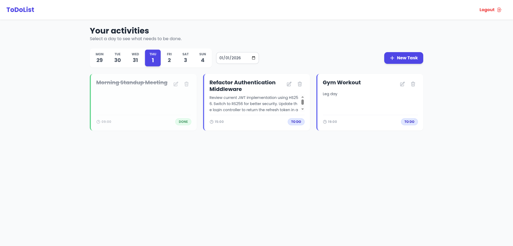
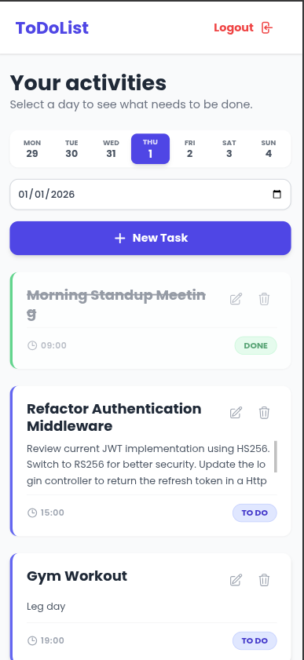
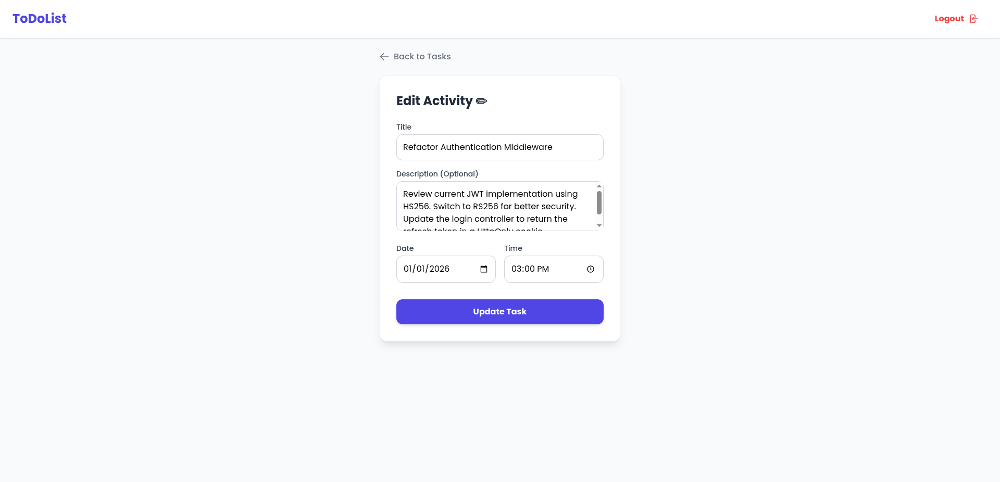
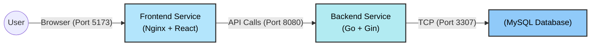

# 📝 ToDoList (Dockerized)

A modern Full-Stack task management application, built with a containerized microservices architecture.

The project demonstrates complete integration between a high-performance **Go (Gin)** backend, a reactive **React** frontend, and a **MySQL** database, all orchestrated via **Docker**.

## 📸 Project screenshot
### Desktop Dashboard
The main hub where you can view, manage, and track all your daily tasks at a glance.


<br>
### Mobile View & Edit Task
Fully responsive design for on-the-go access, plus a dedicated form to update your activities easily.

| Mobile View | Edit Task Form |
| :---: | :---: |
|  |  |

## 🚀 Tech Stack

| Area | Technology | Details |
| :--- | :--- | :--- |
| **Backend** |  | **Gin Gonic**, REST API, Middleware, JWT Auth |
| **Frontend** |  | **Vite**, Nginx |
| **Database** |  | MySQL 8.0, Persistent Volume |
| **DevOps** |  | Docker Compose |

## 🏗️ System Architecture
The project uses Docker Compose to orchestrate 3 isolated services within a private network.



## 🛠️ Quick Start (Installation)
To start the project, you don't need to install Go, Node.js, or MySQL on your computer. You only need Docker.

1. Clone the repository
```bash
git clone https://github.com/GalbasiniMirko/todolist.git
cd todolist
```
2. Configure the environment
```bash
cp .env.example .env
```
3. Start with Docker Compose
```bash
docker compose up --build
```
Wait for the logs to show: **Connected to the database!**.

4. Access

Open your browser and visit: [http://localhost:5173](http://localhost:5173)

## 🔐 Environment Variables
Security is managed via a centralized .env file (ignored by Git). Here are the main configurable variables:
| Variable | Description | Default |
| :--- | :--- | :--- |
| MYSQL_ROOT_PASSWORD | DB Root Password | secret |
| MYSQL_DATABASE | Database Name | todolist |
| DB_EXTERNAL_PORT | External Database Port | 3307 |
| GIN_MODE | Go Server Mode (debug/release) | release |
| PORT | Backend Port | :8080 |
| JWT_SECRET | JWT Signing Secret | change_me_please_this_is_insecure |
| ALLOWED_ORIGIN | Frontend Endpoint (CORS) | [http://localhost:5173](http://localhost:5173) |

## 🗄️ Database & Persistence
 - Automatic Initialization: On first launch, the database/init.sql script automatically creates the **users** and **tasks** tables.
 - Persistence: Data is saved in the **mysql_data** Docker volume, so it is not lost if you stop the containers.

To completely reset the database:
```bash
docker compose down
docker volume rm todolist_mysql_data
docker compose up
```

## 👤 Author
**Mirko Galbasini**
* 🐙 GitHub: [@GalbasiniMirko](https://github.com/GalbasiniMirko)
* 💼 LinkedIn: [Mirko Galbasini](https://it.linkedin.com/in/mirko-galbasini-b96768272)